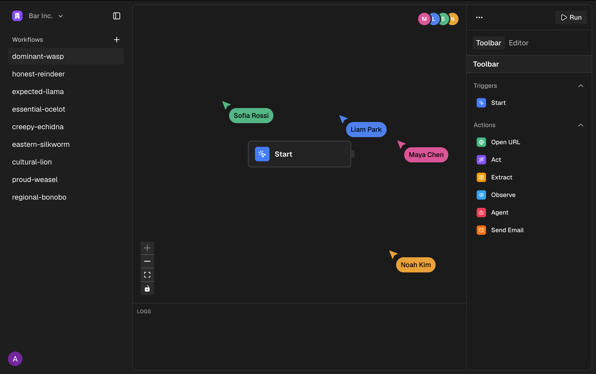
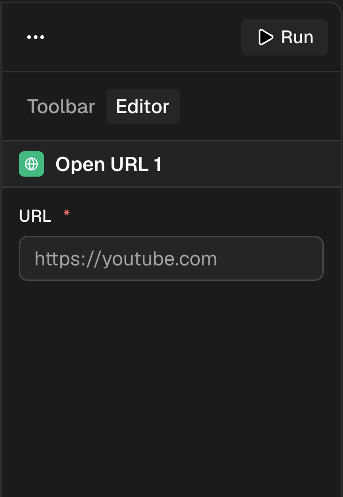
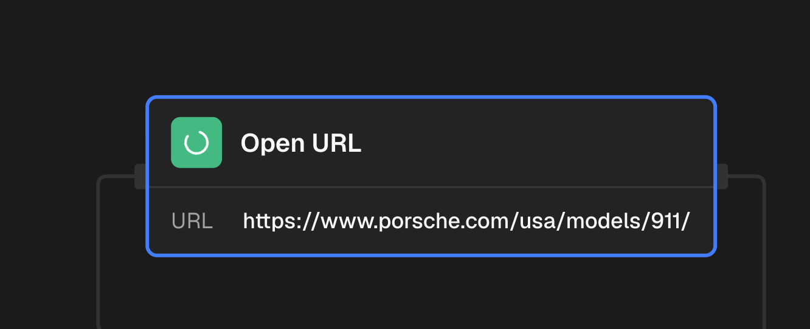

# Conduit

<p align="center">
  <strong>AI-powered browser automation, built as visual workflows.</strong>
</p>

<p align="center">
  Give an AI agent a goal. Let it operate a real browser.
</p>

<p align="center">
  <a href="https://github.com/Ritik-Thakur-sudo/Conduit">GitHub</a>
  ·
  <a href="https://conduit-production-a101.up.railway.app">Live Demo</a>
</p>

---

## Overview

Conduit is an AI-powered workflow automation platform that combines a **visual workflow builder** with **real browser automation**.

Instead of building automations around dozens of rigid API integrations, Conduit lets you create workflows that interact with websites through a real cloud browser.

You can combine deterministic browser actions with autonomous AI agents to build workflows such as:

```
Open URL → Agent → Extract → Send Email
```

For example:

> "Find the cheapest MacBook on this page, extract the product name and price, and email me the results."

The workflow executes as a background job, reports its progress in realtime, and provides access to the Browserbase session replay after execution.

## Preview

### Workflow Builder

<p align="center">
  
</p>
<p align="center"><em>Build browser automation workflows visually.</em></p>

### Workflow Configuration

<p align="center">
  
</p>
<p align="center"><em>Configure workflow nodes directly from the editor.</em></p>

### Live Execution

<p align="center">
  
</p>
<p align="center"><em>Watch workflow nodes execute in realtime.</em></p>

### Execution Logs

<p align="center">
  
</p>
<p align="center"><em>Inspect execution steps, duration, outputs, and errors.</em></p>

## Why Conduit?

Traditional automation platforms commonly depend on predefined API integrations.

That works well when an API exists.

But many websites don't expose the functionality you need through an API.

Conduit takes a different approach:

**Traditional automation**

```
Workflow → API → Service
```

**Conduit**

```
Workflow → Real Browser → Website
                    ↑
                 AI Agent
```

If a human can perform the task through a browser, Conduit aims to make it automatable.

## Features

### Visual Workflow Builder

Build workflows on a React Flow-powered canvas.

- Drag and connect nodes
- Configure each node independently
- Pass data between nodes
- Validate workflow graphs before execution
- Collaborate with other users in realtime

### AI Agent

The Agent node accepts a natural-language goal and autonomously operates the browser.

Goal:

> "Find the cheapest MacBook on this page and send the product name and price to my email."

The agent determines the browser interactions required to complete the task.

### Browser Automation

Conduit uses Browserbase and Stagehand to operate real cloud browsers.

Supported workflow operations include:

- Open URL
- Act
- Observe
- Extract
- Agent
- Send Email

This allows workflows to mix autonomous browser automation with deterministic browser actions.

### Data Flow Between Nodes

Node outputs can be referenced by downstream nodes using template expressions:

```
{{ nodeId.field }}
```

For example:

```
{{ Extract_1.extraction }}
```

This allows information extracted from one node to become input for another.

### Background Execution

Workflows execute through Trigger.dev as background jobs.

Closing the browser tab does not stop an already-triggered workflow.

```
User
  │
  ▼
Conduit
  │
  ▼
Trigger.dev
  │
  ▼
Workflow Task
  │
  ├── Open URL
  ├── Agent
  ├── Extract
  └── Send Email
```

### Realtime Execution

Workflow execution state is published back to the application while the workflow runs.

The console can display:

- Pending
- Running
- Completed
- Failed
- Individual step status
- Step duration
- Node output
- Errors

### Browser Session Replay

Each browser workflow uses a Browserbase session.

The Browserbase session ID is captured during execution so the application can make the session replay available after the workflow completes.

This is particularly useful when debugging autonomous agents.

### Multiplayer Collaboration

Liveblocks provides realtime collaboration for workflow editing.

Multiple members of an organization can work on the same workflow canvas.

### Authentication & Organizations

Clerk handles authentication and organization membership.

Workflow operations are scoped to the active organization.

### Plan-based Feature Gating

Conduit uses Clerk organization plans to gate selected functionality.

For example, workflows containing an Agent node require the organization's Pro plan.

### Production Observability

Sentry provides observability across the application and workflow infrastructure.

Conduit is configured to capture:

- Next.js request errors
- Client-side errors
- Router navigation events
- Server and Edge runtime errors
- Trigger.dev task failures
- Production exceptions

## Architecture

Conduit consists of a Next.js application layer, realtime collaboration, authentication, persistent storage, background workflow execution, and cloud browser automation.

```
                              ┌──────────────────────────┐
                              │          Client          │
                              │     Browser / React UI   │
                              └────────────┬─────────────┘
                                           │
                                           ▼
                              ┌──────────────────────────┐
                              │       Next.js 16         │
                              │      Application         │
                              └────────────┬─────────────┘
                                           │
                    ┌──────────────────────┼──────────────────────┐
                    │                      │                      │
                    ▼                      ▼                      ▼
              ┌──────────┐          ┌────────────┐         ┌────────────┐
              │  Clerk   │          │ Liveblocks │         │ PostgreSQL │
              │ Auth/Org │          │ Realtime   │         │   Neon     │
              └──────────┘          └────────────┘         └────────────┘

                                           │
                                           ▼
                              ┌──────────────────────────┐
                              │      Server Actions      │
                              │    Workflow Operations   │
                              └────────────┬─────────────┘
                                           │
                                           ▼
                              ┌──────────────────────────┐
                              │       Trigger.dev        │
                              │    Background Tasks      │
                              └────────────┬─────────────┘
                                           │
                                           ▼
                              ┌──────────────────────────┐
                              │    Workflow Executor     │
                              │   Dependency Ordering    │
                              └────────────┬─────────────┘
                                           │
                         ┌─────────────────┼─────────────────┐
                         │                 │                 │
                         ▼                 ▼                 ▼
                  ┌────────────┐    ┌────────────┐    ┌────────────┐
                  │ Stagehand  │    │  Resend    │    │  Workflow  │
                  │  Browser   │    │   Email    │    │   Output   │
                  └─────┬──────┘    └────────────┘    └────────────┘
                        │
                        ▼
                  ┌────────────┐
                  │ Browserbase│
                  │ Cloud      │
                  │ Browser    │
                  └────────────┘

                         ┌──────────────────────┐
                         │       Sentry         │
                         │  App + Worker Errors │
                         └──────────────────────┘
```

### Workflow Execution Flow

```
1. User creates or edits a workflow
            │
            ▼
2. Workflow graph is validated
            │
            ▼
3. Workflow graph is persisted
            │
            ▼
4. Trigger.dev run is created
            │
            ▼
5. Workflow executor loads the graph
            │
            ▼
6. Connected nodes are ordered by dependencies
            │
            ▼
7. Node outputs are interpolated into downstream inputs
            │
            ▼
8. Browser session is created lazily
   when the first browser node executes
            │
            ▼
9. Nodes execute sequentially
            │
            ├── Open URL
            ├── Act
            ├── Observe
            ├── Extract
            ├── Agent
            └── Send Email
            │
            ▼
10. Step status and metadata are published
            │
            ▼
11. Browser session is closed
            │
            ▼
12. Session ID remains available for replay
```

## Deployment Architecture

Conduit uses GitHub Actions for CI and Railway for production deployment.

```
                         Git Push / Pull Request
                                  │
                                  ▼
                         ┌─────────────────┐
                         │  GitHub Actions │
                         └────────┬────────┘
                                  │
                  ┌───────────────┼───────────────┐
                  │               │               │
                  ▼               ▼               ▼
               Install          Lint          Typecheck
                  │               │               │
                  └───────────────┼───────────────┘
                                  │
                                  ▼
                         Production Build
                                  │
                                  ▼
                           Docker Build
                                  │
                                  ▼
                              CI Pass
                                  │
                                  ▼
                         ┌─────────────────┐
                         │     Railway     │
                         │ Wait for CI     │
                         └────────┬────────┘
                                  │
                                  ▼
                         Dockerfile Build
                                  │
                                  ▼
                         Production Deploy
                                  │
                                  ▼
                         ┌─────────────────┐
                         │  Conduit v1     │
                         │   Production    │
                         └─────────────────┘
```

The GitHub Actions Docker build validates that the application's Dockerfile can build successfully.

Railway performs the production deployment after the configured GitHub Actions CI checks have completed successfully.

### Production Health Check

Conduit exposes a public health endpoint:

```
GET /api/health
```

Example response:

```json
{
  "status": "ok"
}
```

The endpoint is intentionally accessible without authentication so external deployment and runtime checks can verify application availability.

## Workflow Nodes

Conduit currently supports the following workflow primitives:

| Node           | Purpose                                |
| -------------- | --------------------------------------- |
| **Start**      | Workflow entry point                   |
| **Open URL**   | Navigate to a website                  |
| **Act**        | Perform browser interactions           |
| **Observe**    | Inspect elements on a page             |
| **Extract**    | Extract structured information         |
| **Agent**      | Autonomously operate the browser       |
| **Send Email** | Deliver workflow results through email |

The real power comes from combining them.

For example:

```
Start
  │
  ▼
Open URL
  │
  ▼
Agent
  │
  ▼
Extract
  │
  ▼
Send Email
```

## Tech Stack

| Category                       | Technology           |
| ------------------------------ | --------------------- |
| Framework                      | Next.js 16            |
| Language                       | TypeScript             |
| UI                              | React 19               |
| Workflow Canvas                | React Flow             |
| Authentication & Organizations | Clerk                  |
| Realtime Collaboration         | Liveblocks             |
| Workflow Execution             | Trigger.dev            |
| Browser Automation             | Browserbase            |
| AI Browser Control             | Stagehand              |
| Database                       | PostgreSQL             |
| Database Provider              | Neon                   |
| ORM                             | Drizzle                |
| Email                           | Resend                 |
| Plan-based Feature Gating      | Clerk Organizations    |
| CI                               | GitHub Actions         |
| Containerization                | Docker                  |
| CD / Deployment                | Railway                |
| Observability                   | Sentry                  |

## Project Structure

```
Conduit/
├── .github/
│   └── workflows/
│       └── ci.yml               # GitHub Actions CI pipeline
│
├── app/
│   ├── api/                     # API routes
│   └── (dashboard)/             # Dashboard routes
│
├── components/
│   └── ui/                      # Shared UI components
│
├── features/
│   └── workflows/
│       ├── components/          # Workflow UI
│       ├── hooks/               # Workflow hooks
│       ├── lib/                 # Workflow utilities
│       ├── nodes/               # Workflow node implementations
│       ├── tasks/               # Trigger.dev tasks
│       ├── actions.ts           # Server actions
│       └── data.ts              # Database operations
│
├── hooks/                       # Shared React hooks
├── lib/                         # Shared infrastructure
├── templates/                   # Workflow/template UI resources
├── design/                      # Design resources
│
├── .dockerignore                # Docker build exclusions
├── Dockerfile                   # Multi-stage production image
├── .env.example                 # Environment variable reference
├── liveblocks.config.ts         # Liveblocks configuration
├── drizzle.config.ts            # Drizzle configuration
├── trigger.config.ts            # Trigger.dev configuration
├── instrumentation.ts           # Next.js instrumentation
├── instrumentation-client.ts    # Client-side Sentry instrumentation
├── next.config.ts               # Next.js configuration
├── proxy.ts                     # Clerk request protection
└── package.json
```

## Getting Started

### Prerequisites

You will need accounts and API credentials for the services used by Conduit:

- Clerk
- Neon
- Trigger.dev
- Liveblocks
- Browserbase
- Resend
- Sentry

You will also need:

- Node.js 22+
- npm
- Git

### Clone the Repository

```bash
git clone https://github.com/Ritik-Thakur-sudo/Conduit.git
cd Conduit
```

### Install Dependencies

```bash
npm install
```

### Configure Environment Variables

Create `.env.local`.

Use the repository's `.env.example` as the reference for the required variables:

```bash
cp .env.example .env.local
```

Then add your own credentials.

> Never commit `.env.local` or production credentials.

### Start the Development Server

```bash
npm run dev
```

Open [http://localhost:3000](http://localhost:3000).

## Environment Variables

The project uses environment variables for authentication, database access, workflow execution, browser automation, collaboration, email, and observability.

The current `.env.example` contains the required variable names.

### Clerk

```
NEXT_PUBLIC_CLERK_SIGN_IN_URL=
NEXT_PUBLIC_CLERK_SIGN_UP_URL=
NEXT_PUBLIC_CLERK_SIGN_IN_FALLBACK_REDIRECT_URL=
NEXT_PUBLIC_CLERK_SIGN_UP_FALLBACK_REDIRECT_URL=

NEXT_PUBLIC_CLERK_PUBLISHABLE_KEY=
CLERK_SECRET_KEY=
```

### Database

```
NEON_BRANCH=
DATABASE_URL=
DATABASE_URL_UNPOOLED=
```

### Trigger.dev

```
TRIGGER_SECRET_KEY=
```

### Liveblocks

```
NEXT_PUBLIC_LIVEBLOCKS_PUBLIC_KEY=
LIVEBLOCKS_SECRET_KEY=
```

### Browserbase

```
BROWSERBASE_API_KEY=
```

### Resend

```
RESEND_API_KEY=
```

### Sentry

```
NEXT_PUBLIC_SENTRY_DSN=
SENTRY_DSN=
SENTRY_AUTH_TOKEN=
SENTRY_ORG=
SENTRY_PROJECT=
```

> `SENTRY_AUTH_TOKEN` is a server/build credential and must never be exposed to the browser.

## Available Scripts

### Development

```bash
npm run dev
```

Starts the Next.js development server.

### Production Build

```bash
npm run build
```

Creates the production build.

### Production Server

```bash
npm run start
```

Starts the production Next.js server.

### Type Checking

```bash
npm run typecheck
```

Runs TypeScript type checking.

### Linting

```bash
npm run lint
```

Runs ESLint.

### Formatting

```bash
npm run format
```

Formats TypeScript and TSX source files.

### Database

```bash
npm run db:generate
npm run db:migrate
npm run db:push
npm run db:studio
```

## Docker

Conduit includes a multi-stage Dockerfile for production builds.

The Docker image uses:

```
node:22-alpine
```

and separates the dependency, build, and runtime stages.

```
Dependencies
     │
     ▼
Builder
     │
     ▼
Next.js Standalone Output
     │
     ▼
Production Runner
```

The production container runs the generated Next.js standalone server:

```bash
node server.js
```

To build the image locally:

```bash
docker build -t conduit:local .
```

To run it:

```bash
docker run -p 3000:3000 conduit:local
```

Production environment variables and service credentials must be supplied separately when running the container.

## Deployment

Conduit v1 is deployed on Railway.

The application depends on several external services:

```
                           GitHub
                              │
                              ▼
                           Railway
                              │
                              ▼
                        Next.js App
                              │
          ┌───────────────────┼───────────────────┐
          │                   │                   │
          ▼                   ▼                   ▼
        Clerk                Neon             Liveblocks
          │                   │                   │
          └───────────────────┼───────────────────┘
                              │
                              ▼
                         Trigger.dev
                              │
                              ▼
                        Workflow Tasks
                              │
                    ┌─────────┴─────────┐
                    ▼                   ▼
                Browserbase          Resend
                    │
                    ▼
                Stagehand
                    │
                    ▼
               Cloud Browser
```

Trigger.dev runs workflow tasks independently from the Next.js request lifecycle.

## CI/CD

Conduit uses GitHub Actions for continuous integration and Railway for continuous deployment.

### Continuous Integration

Every push to `main` and pull request targeting `main` runs:

- Dependency installation with `npm ci`
- ESLint
- TypeScript type checking
- Next.js production build
- Docker image build

The Docker build runs only after the validation job succeeds.

### Continuous Deployment

Railway is connected to the `main` branch and automatically deploys changes.

Railway is configured to wait for GitHub Actions CI to complete successfully before deploying.

This creates a basic deployment gate:

```
Code Change
    │
    ▼
GitHub Actions
    │
    ├── Install
    ├── Lint
    ├── Typecheck
    ├── Production Build
    └── Docker Build
            │
            ▼
         CI Pass
            │
            ▼
         Railway
            │
            ▼
      Production Deploy
```

### Development Checks

Before pushing changes, run:

```bash
npm run typecheck
npm run lint
npm run build
```

These same validation steps are enforced through GitHub Actions.

The production build is especially important because Conduit spans multiple execution environments:

- Next.js server
- Next.js client
- Edge instrumentation
- Trigger.dev workers
- Cloud browser sessions

## Testing Status

Conduit currently does not include a dedicated unit or integration test suite.

The current CI pipeline validates the project through:

- Dependency installation
- ESLint
- TypeScript type checking
- Production build
- Docker image build

Automated unit, integration, and end-to-end testing are planned for a future iteration.

## Roadmap

### v1 — Completed

- [x] Visual workflow builder
- [x] React Flow canvas
- [x] Workflow node system
- [x] AI Agent node
- [x] Browser automation
- [x] Browserbase integration
- [x] Stagehand integration
- [x] Trigger.dev background execution
- [x] Realtime execution monitoring
- [x] Workflow run cancellation
- [x] Liveblocks collaboration
- [x] Clerk authentication
- [x] Clerk organizations
- [x] PostgreSQL persistence
- [x] Neon integration
- [x] Drizzle ORM
- [x] Browser session replay
- [x] Email delivery
- [x] Pro plan feature gating
- [x] Sentry observability
- [x] Production health endpoint
- [x] Docker production image
- [x] GitHub Actions CI
- [x] Railway deployment

### v2 — Planned

- [ ] Workflow templates
- [ ] Scheduled workflows
- [ ] Recurring workflow triggers
- [ ] Webhook triggers
- [ ] More workflow nodes
- [ ] Improved retry policies
- [ ] Advanced workflow error handling
- [ ] Workflow analytics
- [ ] Usage-based billing
- [ ] Expanded agent capabilities
- [ ] Improved workflow history
- [ ] Unit and integration test coverage
- [ ] Automated E2E testing
- [ ] CI dependency/security checks

## Project Status

Conduit v1 is complete and deployed.

The first version establishes the core Conduit platform:

```
Visual Workflows
       +
AI Browser Automation
       +
Background Execution
       +
Realtime Collaboration
       +
Browser Session Replay
       +
Production Observability
       +
CI/CD Infrastructure
```

The next stage of development will focus on reliability, testing, user experience, and expanding the capabilities of the automation engine.

## Contributing

Contributions and suggestions are welcome.

If you find a bug or have an idea for Conduit, feel free to open an issue or submit a pull request.

Before submitting a change, run:

```bash
npm run typecheck
npm run lint
npm run build
```

## Author

**Ritik Thakur**

GitHub: [https://github.com/Ritik-Thakur-sudo](https://github.com/Ritik-Thakur-sudo)

## License

License information will be added in a future release.
